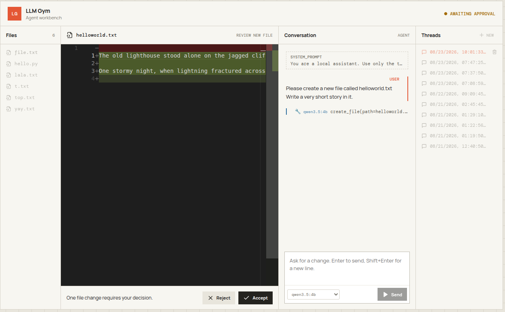
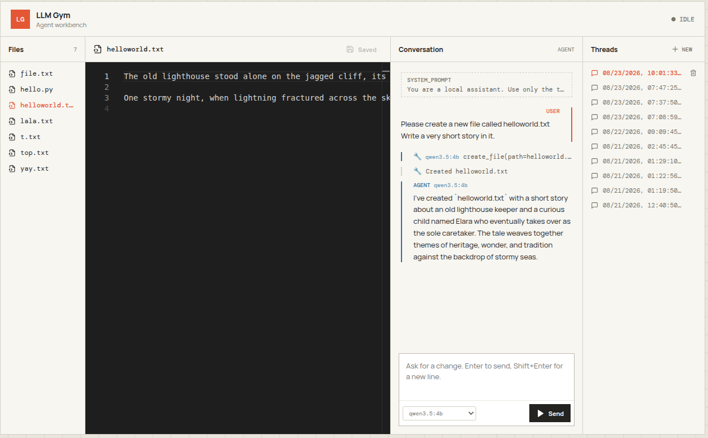
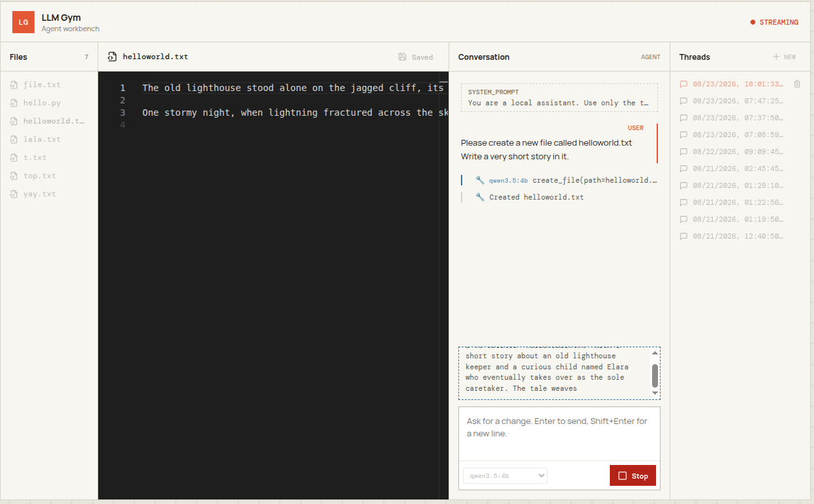

# llm-gym

A LangGraph agent that edits files under human approval. It runs against local
models through Ollama, so nothing leaves the machine.



Nothing reaches disk until you accept the diff.

## Notable

- A paused approval is a checkpoint, so a server restart mid-decision loses nothing.
- `read_file` returns a content hash that `propose_edit` must hand back, so an edit
  built against a stale version is refused instead of overwriting your work.
- Every agent-supplied path goes through one `resolve()`, confining the agent to
  `test_workspace/`.
- Threads live in SQLite and the browser owns the thread id.
- Any local Ollama model, switchable per message, and each chat line records which
  one wrote it.

The status pill in the top right is the graph's state.

| `IDLE` | `STREAMING` |
|---|---|
|  |  |

## Running it

Needs [Ollama](https://ollama.com) running, and the models listed in
`llm_gym/models.py` pulled.

```
ollama pull qwen3.5:4b
make install
make dev
```

Then http://localhost:5173.

## Not built yet

- A web search tool
- BC / RL on the stored trajectories, using accepted and rejected edits as the signal
- Target task: read a CV, find matching jobs, filter on location, skill overlap and
  seniority, and output a table of links with no duplicates
